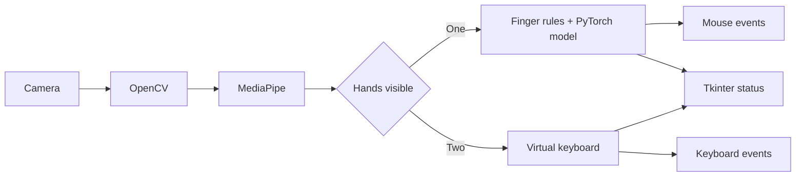

# Gesture Control

A hands-free computer control application built with Python and computer vision. It tracks hands from a webcam to move and click the mouse, scroll, and type with an on-screen virtual keyboard.

## Demo

[▶ Watch the demo video](download.mp4)

## Features

- One-hand mouse mode with cursor movement, left click, held left click, right click, and scrolling.
- Two-hand keyboard mode with letters, Space, Enter, and Backspace drawn on the camera preview.
- Real-time hand landmarks from MediaPipe and a bundled four-class PyTorch gesture model for scrolling and open-hand calibration.
- Tkinter control panel with live camera, mode, gesture, and action status; recent action history; adjustable settings; and a quick stop control.
- Configurable pointer/drag and scroll mappings, sensitivity, smoothness, scroll speed, camera index, and image mirroring.

## How it works



OpenCV reads a 1280 × 720 camera stream. MediaPipe provides 21 landmarks per hand. With one hand, finger states route pointer and click poses directly; other poses go through the bundled PyTorch classifier. An open hand updates click calibration. With two hands, extending and then bending a finger over a drawn key types it. The camera preview remains in a separate OpenCV window while the Tkinter panel shows live status and settings.

The model input transformation and the original calibration math are preserved to match the bundled weights. They may look unconventional; changing them would require retraining and hardware validation.

## Requirements

- 64-bit Windows with Python 3.14 and a working webcam.
- A display session with permission to control the mouse and keyboard.
- `tkinter`, normally included with the Windows Python installer.

The project was developed on Windows. Linux and macOS behavior is unverified; the `mouse` package has platform-specific requirements.

## Installation

```powershell
git clone https://github.com/F1ni/Mouse-AI-With-Gestures-NEA.git
cd Mouse-AI-With-Gestures-NEA
py -3.14 -m venv .venv
.venv\Scripts\Activate.ps1
python -m pip install -r requirements.txt
```

If PowerShell blocks activation, run `.venv\Scripts\python.exe` in place of `python` in subsequent commands. The bundled `model.pth` must remain in the repository root.

## Run

```powershell
python -m gesture_control
```

`python main.py` is also supported. Choose the camera index in **Controls & settings** if the default camera (`0`) is not the one you want. Press **Start control**, `O`, or `Ctrl+O`; press **Stop control** or `Esc` to stop. `Esc` also closes control from the camera preview.

### Controls

| What the camera sees | Action |
| --- | --- |
| Thumb and index raised | Move cursor; bring thumb toward index to left click. |
| Thumb, index, and middle raised | Move cursor; bring middle toward index to hold left click, then separate to release. |
| Thumb, index, and little finger raised | Right click once per pose. |
| Learned scroll pose 1 / 2 | Scroll up / down by default; directions can be swapped. |
| Open hand | Recalibrate click distances. |
| Two hands | Show virtual keyboard; hover over a key and bend a finger to type. |
| Middle finger alone | Send `Alt+F4` to close the active window. |

The available keyboard keys are A–Z, Space, Enter, and Backspace. Mouse/keyboard mode switches automatically based on whether one or two hands are detected. The pink rectangle in the preview marks the cursor control area. Start with even lighting and keep your hands fully visible.

## Settings

`settings.json` stores the same defaults as the latest working script: sensitivity `1`, smoothness `4`, scroll speed `2`, mirrored front-facing view, and the original gesture mappings. The control panel can update these values and set a camera index. Click **Save settings** to persist changes. Settings take effect on the next start; stop and restart control after changing them.

The pointer left-click distance in the released implementation is a fixed 70 pixels. Other click paths use the open-hand calibration values. This distinction is retained for behavioral compatibility.

## Project structure

```text
gesture_control/
  __main__.py       CLI entry point
  ui.py             Tkinter panel and status updates
  engine.py         Camera loop and gesture routing
  vision.py         Landmark and feature calculations
  mouse_control.py  Cursor and mouse actions
  keyboard.py       Virtual keyboard layout and input
  model.py          PyTorch inference architecture
  config.py         Settings and paths
  history.py        Recent action history
tests/              Deterministic core tests
model.pth           Bundled gesture classifier weights
settings.json       Default user settings
main.py             Alternative entry point
```

## Tests

```powershell
python -m unittest discover -s tests -v
```

These tests check deterministic settings, feature transformations, cursor math, mouse and keyboard mappings, and history. They do not simulate a webcam or verify OS-level input events.

## Limitations and future work

- Gesture quality depends on lighting, camera framing, and hand visibility. Mouse coordinates assume the requested 1280 × 720 frame, so cameras that choose a different resolution may need a future mapping update.
- There is no confidence gate on the four-class model output in the original control loop; uncertain poses can still result in scrolling.
- The one-hand recognition rules and calibration formula are kept unchanged until they can be compared against real hardware.
- A future release could add a repeatable webcam validation protocol, model retraining workflow, and a preview embedded in the control panel.

## Contributing

Issues and focused pull requests are welcome. Please describe your OS, Python version, camera setup, and exact gesture when reporting a control issue. Keep changes to gesture thresholds or mappings separate from interface fixes and include a clear before/after hardware check.

## License

MIT. See [LICENSE](LICENSE). The bundled model weights come from the original project; contributors should confirm their provenance before redistributing them elsewhere.
